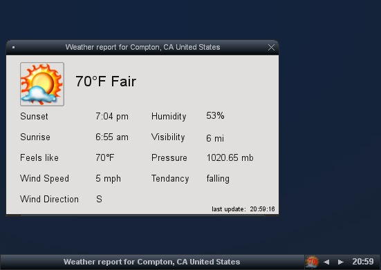
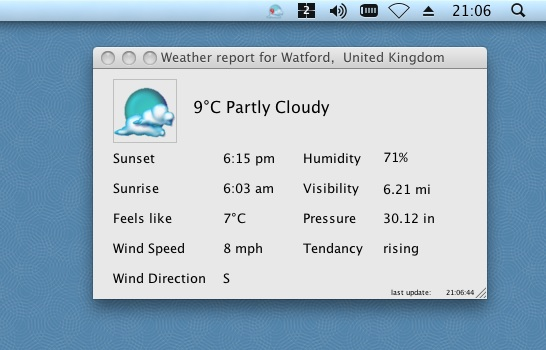
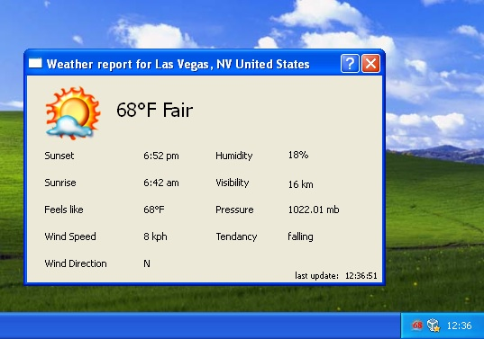

# python-pigeonfeather
Automatically exported from [code.google.com/p/pigeonfeather](https://code.google.com/archive/p/pigeonfeather/)

Pigeon Feather is a dock application which displays the weather for a given location and displays a simple weather report.

It is written in Python and uses PyQt4 and lxml. The icons have been taken from kweather.

It is inspired by kweather which at the time of this projects creation had not been ported to kde4.

It is known to work well on Linux, Mac OSX and Windows.

## Screenshots

